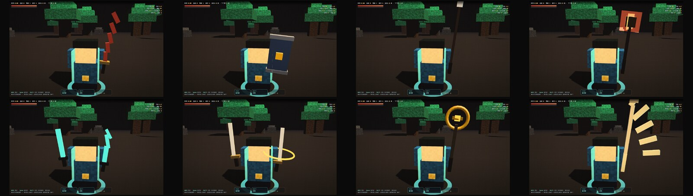

# 可玩版：Voxel Survivors（v2.8 — Boss 技能 + 据点野怪 + 直线火焰）

## v2.22：冰大招改成"控制技"（原来根本看不到冻结）

**问题**（玩家反馈）：*「冰属性大招怎么没有冻结的效果」*

**真相**：冻结机制**一直在工作** —— 但冰大招的伤害是 `d0 × 0.55` ≈ **74~148**，
而小兵血量只有 27~70。所以一放就把整个范围**直接秒掉**，你看到的全是尸体，
永远看不到"冻住"的过程。

实测（修复前）：

```
半径内 88 个敌人 → 施放后大部分变「死亡」
1 秒后：59 个已死 · 8 个在硬直 · 0 个移动
```

**修法 —— 重新定位成控制技**：

| 项 | 改前 | 改后 |
|---|---|---|
| 伤害 | `d0 × 0.55`（≈74~148）| **`d0 × 0.12`**（≈12）|
| 冻结时长 | 3.2s | **3.6s** |
| 冻结增伤 | 无 | **冻住的目标受伤 +50%** |
| 视觉 | 只有敌人停住 | **半透明冰块套在身上**（池化 14 个，快解冻时变淡）|

**为什么加「冻结增伤」**：冰单独拿出来没有输出，所以给它一个明确的战术定位 ——
**先冻再打**。冻住的敌人吃 1.5 倍伤害，配合普攻/旋风斩就是一套连招。
三个属性的分工也清楚了：🔥 输出 · ⚡ 全屏打击 · ❄️ 控场起手。

实测（修复后）：

```
半径内 88 个 → 1 秒后：70 个被冻住 · 2 个移动 · 18 个已死
平均掉血 11.9（原 74~148）· 14 个冰块可见
```

---

## v2.21：⚠️ 修 bug —— 大招一局只能放一次

**问题**（玩家反馈）：*「大招怎么就放了一次，后面时间到了还是放不了」*

**根因**：`S.cdNova` 被设为 480 后**从来没有被递减过** —— 全文件没有 `cdNova--`。
`git log -S "cdNova--"` 显示**这一行从大招诞生的第一天起就不存在**。
冷却永远停在 480，所以只有第一次能放。

**为什么逃过了所有测试**：之前每次测试都是手动 `S.cdNova = 0` 再施放 ——
只验证了「能不能放」，**从没验证过「冷却结束后能不能再放」**。
（冷却条 UI 会一直显示满格，但没人盯着看。）

**修复后回归验证**（不手动清零，纯自然冷却）：

```
第1次施放 ✓（冷却 480）
4 秒后    剩 240   ← 正常递减
8.1 秒后  剩 0
第2次施放 ✓   第3次施放 ✓
```

**顺带做了系统性排查**：脚本扫了所有「被赋值成倒计时」的变量，找出 3 个可疑 ——
`cdNova`（真 bug）· `bossIn`（误报，用了 `--S.bossIn` 前缀写法）·
`monsterT`（误报，它是累加计数器）。所以这个类别的 bug 只有这一处。

---

## v2.20：大招冷却 12 秒 → 8 秒

**问题**（玩家反馈）：*「大招 cd 时间太久了」*

`SKILL.nova.cd: 720 → 480`（帧，60fps）。

| | 改前 | 改后 |
|---|---|---|
| 冷却 | 12.0s | **8.0s** |
| 每 20 秒一波能放 | 1.7 次 | **2.5 次** |
| 3 分钟一局能放 | 15 次 | **22 次** |
| 灼烧带覆盖率（4.5s 持续）| 38% | **56%** |
| 冻结覆盖率（3.2s 持续）| 27% | **40%** |

**为什么这次缩短比数字看起来更重要**：三种属性**共用同一个冷却**。
12 秒时一局放不了几次，"按需切换属性"这个机制其实是**摆设** ——
你只会一直用最顺手的那一个。8 秒后才真正做到"看场上情况选属性"。

**调参**：`SKILL.nova.cd` 一个数字，480 = 8 秒，360 = 6 秒。

---

## v2.19：键位重排（QWER 那排）+ 鼠标支持

**问题**（玩家反馈）：*「按键设置的太奇怪了，qwer 这些是否更适合？」*

**先说明一个约束**：`W` 已经被移动占用了（WASD），所以字面意义的 QWER 用不了。
实际可用的是 **Q / E / R / F** 这一排 —— 食指和中指不离 WASD 就能按到。

| 动作 | 主键位 | 备用 |
|---|---|---|
| 旋风斩 | **Q** | Space（旧）· **鼠标左键** |
| 冲刺 | **E** | Shift（旧）· **鼠标右键** |
| 终极技 | **R** | — |
| 切换属性 | **F** | **鼠标滚轮** |

**旧键全部保留**（Space/Shift 照旧能按），不破坏已有肌肉记忆。同时补了鼠标支持 ——
之前完全不能用鼠标，这在 ARPG 手感上是个空缺。

⚠️ **UI 保护**：点技能卡 / 升级卡 / 按钮时**不会**触发技能。
判据是 `e.target.closest('#levelup, #over, #consent, #skills, button, .ui')` ——
不判断的话，点升级卡选强化会同时放一个旋风斩（右键菜单也同理，已 preventDefault）。

实测 7 条输入路径全通：Q/E/R/F + Space/Shift + 鼠标左右键 + 点 UI 不误触 ✓

---

## v2.18：普攻范围 +36%，小兵血量 −21%

**问题**（玩家反馈）：*「前面小兵的护甲、血量可以降低些吗？然后普通攻击的范围长度加大一些，
不然太小了打不死小兵」*

**先澄清一个概念**：这游戏**没有护甲机制** —— `view.js` 里的 "armor" 只是配色字段。
所以「护甲血量」实际就是**血量**。

**根因**：小兵的出手距离是 `attackRange: 1.9`，玩家普攻半径只有 `2.5` ——
只比小兵多 0.6，而兵潮是**环形包围**的。结果就是「被围住却只能蹭到最内层两三个」，
观感上就是"打不死"。

| 项 | 改前 | 改后 | 变化 |
|---|---|---|---|
| 普攻半径 | 2.5 | **3.4** | **+36%** |
| 小兵血量（1 波）| 34 | **27** | −21% |
| 血量成长 | `×(1+0.22k)` | `×(1+0.19k)` | 前期更轻 |

**实测**（40 个小兵围在身边，一次普攻）：

```
命中 22 个 · 当场打死 11 个 · 命中率 55%
```

**节奏验证**（`?auto=1&bot=1` 挂机 60 秒）：167 击杀 @20s → 382 @40s → **535 @60s**，
等级 3（约 20 秒一级，和设计目标一致）。

---

## v2.17：打击感（受击后退 / 火星 / 音效 / 命中停顿）

**问题**：以前只有「击杀」才有反馈 —— 打中但没打死完全没有手感，砍空气和砍人没区别。

四件事同时做（只在**每一次命中**触发）：

| 效果 | 实现 | 参数 |
|---|---|---|
| **受击后退** | 沿「玩家→敌人」方向推开 | 普通 0.34 / 暴击 0.62（Boss 推不动）|
| **火星粒子** | `burst()` | 普通 2 颗 / 暴击 5 颗（金色，暴击白色）|
| **音效** | 高通噪声 + 随机音高 | `noise(0.05, 0.034, 1900×p)` |
| **命中停顿** | `game.freeze` | 1 命中 2 帧 / 3 命中 4 帧 / 6 命中 6 帧 / 暴击 4 帧 |

**三个必须做的工程细节**（否则会变成噪音/卡顿）：

1. **音效必须限频** —— 击杀速度是 9/秒，每一下都放会把音频通道打爆。
   加了 45ms 冷却 + 音高随机 0.9~1.25×，连击才不像机关枪。
2. **停顿必须封顶** —— 停顿是全局的（连玩家一起停），打一群兵时如果按命中数线性加帧会卡死。
   上限 6 帧。
3. **粒子池要扩容** —— 每一下都出火星，220 个不够（会被瞬间填满冲掉击杀特效）。提到 420。

**敌人受击震动**：`lib/view.js` 的震动幅度 0.05 → **0.11**（原来小到看不出在抖）。
硬直帧数也从 6/10 提到 **8/13**（硬直同时驱动震动时长，所以这是感受强弱的主要旋钮）。

### ⚠️ 顺带修掉一个真 bug

写打击感的测试时发现：**普攻和旋风斩根本打不到野怪**（只有大招和灼烧能打）。
从 v2.6 加野怪时就漏了 —— 野怪能贴脸砍你，你还不了手。

修完实测：野怪 170 HP → 66 HP，命中 4 次 ✓。所有打野怪的路径（普攻/旋风斩/火/雷/冰/灼烧/自爆）
现在统一走 `hitMonster()`，保证每一下都有完整反馈。

---

## v2.16：障碍物 + 药水 + 三种终极技（玩家四项要求）

### ① 石头和树会挡路（挡玩家 / 野怪 / 兵潮）

30 个确定性散布的障碍（16 石头 + 14 树，黄金角分布，多跑几局能记住地图）。
- 石头：血 170，半径 1.02｜树：血 105，半径 0.70
- 圆形推挤：玩家（半径 0.55）、野怪、兵潮都绕不过去
- 兵潮只算玩家 30 米内的障碍（否则 30×300 全量距离计算没必要）

⚠️ **改这个时发现一个老 bug**：场景自带的老树是 `r = 22~50` 随机散布，但活动区半径是 **46** ——
大树长在战场正中间，走过去镜头会被一整块绿色占满（截图里整个视野糊掉）。
推送外圈（r = 47~70）变成树线 + 加遮挡剔除（镜头附近的直接隐藏）才修好。

### ② 石头树能打爆，掉药

普攻 / 旋风斩 / 三种终极技都能打。爆了 55-60% 掉一瓶药：

| 药水 | 效果 | 实测 |
|---|---|---|
| 🧪 Health Flask | +25 HP | ✓ |
| 🌀 Swift Draught | +25% 移速 12 秒 | ✓ 11.8s |
| 💥 Rage Tonic | +35% 伤害 12 秒 | ✓ 11.8s |

药水也吃磁吸（6 米内自动飞过来），HUD 底部有 buff 倒计时条。
实测：9 瓶一次捡完 → HP 40→100、速度与力量 buff 同时挂上。

### ③ 终极技不再需要打 boss 解锁

开局就能放，只看冷却。第一个 boss 现在只负责「据点野怪开始出现」。

### ④ 三种终极技，Q 键 / 点卡片切换（共用 12 秒冷却）

| 属性 | 名称 | 效果 |
|---|---|---|
| 🔥 火 | **Flame Lance** | 直线穿透（长 20、半宽 1.9）+ 地面灼烧带 |
| ⚡ 雷 | **Thunderfall** | 视野半径 17.5 内每目标一道落雷，最多 26 道 + 短暂麻痹 |
| ❄️ 冰 | **Deep Freeze** | 半径 10.5 全冻结 3.2 秒（Boss 只冻 35%）+ 霜环 |

**冻结怎么实现的**：不改 `lib/crowd.js` —— 每帧把被冻单位的状态重置成 `HURT` 且 `stT = 0`，
状态机就永远推进不出去（等价于定住）。⚠️ 必须跳过 `DEAD`/`OFF`，否则会把尸体复活成受伤状态。

实测：bolt 一次 14 道闪电可见｜frost 生成霜环且近身敌人全部锁定在 HURT｜三者共用冷却 12s ✓

---

## v2.13：8 种装备 = 8 种武器外观

v2.12 是「8 件装备往同一把剑上加料」。玩家反馈想要**换武器**，于是改成：
**每捡一件装备就换一把对应造型的武器**（同一把武器仍随收集总数变大）。



| 装备 | 武器 | 剪影特征 |
|---|---|---|
| — （起点）| 素钢短剑 | 标准剑 |
| 血刃 | **血色弯刀** | 5 段递进旋转的弧刃 |
| 铁甲 | **塔盾** | 大片蓝盾 + 金盾钉 |
| 战靴 | **长枪** | 3.2 米枪身 + 叶形枪尖 |
| 火符 | **火焰法杖** | 铁笼包火球 + 3 层加色火焰 |
| 锐石 | **水晶双匕** | 青玉菱形刃 ×2（人造水晶，半透自发光）|
| 时砂 | **双刀** | 双持银刀 + 环绕金环 |
| 护符 | **圣杖** | 金环 + 宝石 + 横杆 |
| 狂骨 | **骨镰** | 2.1 米骨柄 + 5 段弧骨刃 |

**设计要点**：
- 换武器比"堆装饰"的辨识度高得多 —— 从俯瞰视角就能一眼认出拿的是什么
- 但保留 v2.12 的成长感：`g.scale = 1 + 0.028 × 收集数`（同一把武器也在长）
- 基础剑身长度按武器类型定（短剑 1.0 / 长枪 3.2 / 双刀 1.25），不再统一拉伸 —— 否则长枪会拉到荒唐

**开发参数**：

```
?wep=0..7    强制显示第 N 种武器（QA/宣传图，自动把前 N 件装备也算上）
```

---

## v2.12：手中武器随装备成长

**问题**（玩家反馈）：*「武器的装饰没出息，我现在是固定的武器，不够吸引人，
后面打了 boss、野怪掉落装备后，是否可以体现在人物手中的装饰」*

**处理**：主角原本**根本没拿武器**（雕塑里只有身体，普攻是地面扇形）。现在给他一把剑，
**每捡一件装备就往剑上长一处装饰**，剑身同时变长变宽 —— 武器就是你的装备清单。

挂在 `heroMesh` 下（子对象）→ 位置/朝向/无敌帧闪烁/旋风斩自转全部自动跟随，零同步代码。

| 装备 | 剑上的体现 |
|---|---|
| 0 件（起点）| 一把素钢短剑（剑身 1.0）|
| 血刃 | **剑身变血红** + 血槽铭纹 |
| 铁甲 | 护手加宽 |
| 战靴 | 剑柄加配重块 |
| 火符 | 剑身缠火焰 + 自发光 |
| 锐石 | 护手两侧镶青玉宝石 |
| 时砂 | **金色光环绕剑慢转** |
| 护符 | 护手下挂金色吊坠 |
| 狂骨 | 护手长出骨刺 |
| 满 6 件 | 剑身外扩气场环（贴地）|

**成长幅度**：剑身 1.0 → **2.8**（满装比人物还高）· 宽度 +50% · 3 件起出现铭纹。

**普攻会挥砍**：武器跟着 `S.atkFlash` 从静息位劈出去再收回（`rotation.z` −0.11 → −1.46）。

**开发参数**（做宣传图/QA 用）：

```
?gear=8       预置 8 件装备（看满装武器）
?closeup=1    相机拉近到 4.2 并缓慢环绕（截图/宣传图）
```

---

## v2.11：同批伤害递减（安全网）

**目的**：保留「被一群兵围住」的视觉压迫感，但削掉"一口暴毙"。

同一帧（0.5 秒窗口内）连挨的第 2/3/4/5 下依次 ×0.75 / 0.6 / 0.45 / 0.35：

```
实测（同帧连挨 5 下）: [4.4, 3.3, 2.64, 1.98, 1.54] = 13.9 点   （改前 22.0 点，−37%）
Boss 重击: 17.6 点 —— 不受递减 ✓（有预警、可躲，不该被削）
```

⚠️ **但实测发现这个机制很少触发**：小兵其实是**轮流打**的（有 attack token 串行化）。
把玩家钉在 200 兵中间测得 **30 秒只挨 12 下**（平均 2.5 秒一下），远超 0.5 秒窗口。
所以它只是**安全网**（应对"冲进新兵堆时一群兵同时出手"），**不是主力的减伤手段**。

→ 真正解决"前 4 级伤害高"的是 **v2.10 的等级折扣**（−38% 递减到 −10%）。
   两者叠加后，1 级站在兵潮中心 30 秒：**56 点 → 约 35 点**（生存时间 53 秒 → 85 秒）。

**调参位置**：`COMBO.window`（窗口帧数）/ `COMBO.mul`（各档折扣）。

---

## v2.10：前 4 级小兵伤害下调

**问题**（玩家反馈）：*「前面 4 级的小兵伤害高了些」*

**根因**：不只是单次伤害高，还有**同时打你的人多** ——  /  意味着
最多 5 个兵同时出手，1 级时一轮最多吃 （36% 血）。

**处理**：给 1-4 级加线性折扣，第 5 级起折扣 = 1 **无缝回到原曲线**（不是硬砍一刀）：

| 等级 | 原伤害 | 现伤害 | 变化 | 一轮最多吃 |
|---|---|---|---|---|
| 1 | 7.1 | **4.4** | **−38%** | 36 → **22 点** |
| 2 | 7.5 | 5.3 | −29% | 37 → 27 点 |
| 3 | 7.8 | 6.3 | −19% | 39 → 32 点 |
| 4 | 8.2 | 7.4 | −10% | 41 → 37 点 |
| 5+ | 8.5 | 8.5 | 不变 | 43 点 |

`CFG.earlyGrace(lv)` —— 改一个系数就能调（0.62 = 1 级折扣，0.095 = 每级回升量）。

---

## v2.8：Boss 从「血厚小兵」变成真 Boss

**问题**（玩家反馈）：*「总共有多少轮 boss？现在 boss 强度太低，没有技能纯挨打」*

**答案**：**每 3 波一个（wave 3/6/9/12…），无限循环** —— 幸存者类没有终点。
HUD 上现在直接显示：`BOSS 3 杀 · 下个第 12 波`。

**改动**：

| 项 | 改动前 | 改动后 |
|---|---|---|
| 血量 | 300 基础（+40%/波）| **420 基础（+50%/波）** |
| 普攻伤害 | 3.2 倍 | **4.0 倍** |
| 技能 | **无 —— 只会走过来挨打** | **三套技能 + 狂暴** ↓ |

### Boss 技能

| 技能 | 预警 | 效果 | 应对 |
|---|---|---|---|
| **冲锋** | 地面**红线段** 0.7s 蓄力 | 22 速度直线突进，撞到 **4 倍伤害 + 击退** | 侧向 Shift 闪开 |
| **践踏** | 地面**红圈** 0.6s 蓄力 | 5 米范围震地 **5 倍伤害**（也会震死自己小兵）| 跑出圈 / Shift |
| **召唤** | 0.5s 咆哮横幅 | **召唤 3 只野怪**（不受据点限制，直接追你）| 先清小怪或直接集火 Boss |
| **狂暴** | 血量 <35% + 横幅 | 移速 **+40%**、伤害 **×1.25** | 留技能/冲刺 |

> 设计意图：**预警 → 反应**。三段技能都有 0.6-0.7 秒的地面预警，给玩家「看预警 → 用冲刺躲」的操作空间，
> 而不是纯数值对拼。这样 Boss 战才有节奏，不是站着换血。

### 技能按「第几个 Boss」逐个解锁（v2.9）—— 每场 Boss 战教一个新机制

| Boss # | 本场技能 | 技能节奏 | 狂暴线 | 教学意图 |
|---|---|---|---|---|
| **#1** | 冲锋 | cd 220 | 30% | 教你认「红线段预警」+ 用冲刺侧闪 |
| **#2** | 冲锋 / 践踏 | cd 210 | 30% | 教你认「红圈预警」+ 跑出范围 |
| **#3** | 冲锋 / 践踏 / 召唤 | cd 200 | 32% | 教你处理「Boss 召小怪」的优先级 |
| **#4+** | 冲锋×2 / 践踏 / 召唤 | **cd 150** | **40%** | 技能更频繁 + 更早狂暴，考综合操作 |

Boss 降临时横幅显示 ，并弹提示  —— 玩家一眼知道这场要防什么。

---

## v2.7 两项设计改动（按试玩反馈）

## v2.7 两项设计改动（按试玩反馈）

### ① 野怪改成「据点」型 —— 等你来探索，不主动追你

| 项 | 改动前 | 改动后 |
|---|---|---|
| 位置 | 随机刷在玩家周围 | **6 个固定据点**（距中心 20-38，各有图腾柱 + 领地圈标识）|
| 行为 | **主动追击玩家** | **只在领地里游荡**；玩家**踏进领地才激活**，出去就回巢 |
| 约束 | 无 | **硬 leash**：任何情况下不跑出领地半径（实测最远 5.03 ≤ 6.5）|
| 激活提示 | 无 | 领地圈变红 + 图腾发光 |
| 清剿奖励 | 仅单只掉落 | **全灭必掉一件装备** + 横幅「据点清剿」，45 秒后重新集结 |

→ 结构变成：**兵潮给你压力（追你）· 据点给你探索（等你）**。风险回报由你自己选什么时候去打。

### ② E 技能改为直线火焰冲击

| 项 | 改动前 | 改动后 |
|---|---|---|
| 形状 | 360° 圆形新星 | **朝向前方的直线**：长 20、半宽 1.9 |
| 判定 | 半径内全部 | **沿线方向 0~20、垂直距离 ≤1.9 内全部吃伤害**（实测：前方野怪 −117、后方 −0）|
| 视觉 | 圆形冲击环 | **一条火焰条带** + 沿线 22 处火焰粒子 + 地面留下 4.5 秒灼烧带 |
| 名字 | 烈焰新星 | **烈焰冲击** |

> ⚠️ **旋风斩（SPACE）保留 360°**：它是被 300 兵包围时的唯一解围手段，改成直线会让围殴变成无解。
> 如果你也想改，说一声（可以改成"前方宽扇形"折中）。

---


## 玩法全貌（v2.7）

```
每级被动        伤害+6%/级 · 范围+4%/级
三选一升级      保底一个输出项 + 2 随机
装备掉落(8种)   击杀野怪/Boss → 磁吸拾取 → 永久被动
技能解锁        首 Boss → E 烈焰新星（大范围 + 灼烧地面）
四类野怪        击杀首 Boss 后出现**据点**，你进去才打（探索 + 风险回报）
波次压力        敌血+22%/波 · 小兵伤害随波次+等级
```

### 野怪分类（v2.6）

| 类型 | 外观 | 行为 | 战术压力 | 血量 | 掉落 |
|---|---|---|---|---|---|
| 🐺 **獠牙兽** | 暗红四足兽（奔跑摆腿）| 追击 → 蓄力前倾 → 扑咬 | 基础压力 | 170 | 45% |
| 🎯 **吐酸者** | 绿色漂浮酸囊 + 垂须 | 保持 8.5 距离，喷**酸液弹** | 逼你贴身或走位躲 | 130 | 50% |
| 💣 **自爆虫** | 圆甲壳 + 顶部引信 | 极速冲脸，近身**引信 0.63 秒后爆炸** | 逼你在远处点掉（爆了还伤友军）| 95 | 40% |
| ✨ **萨满** | 兜帽法袍 + 发光法杖 | 远程，每 4 秒**治疗周围野怪 + 军官/Boss** | **必须优先秒掉**（否则 Boss 打不死）| 165 | 65% |

**出现节奏**：wave 3 Boss 死 → 解锁野怪（第 4 波起按 wave 逐步加入吐酸者/自爆虫/萨满，wave 8+ 全类型混合）。

### 掉落装备（8 种，走到 5.5 米内自动磁吸）

| ⚔️ 血刃 | 🛡️ 铁甲 | 👟 战靴 | 🔥 火符 |
|---|---|---|---|
| 击杀回 2 HP | 上限 +25 回满 | 移速 +12% | **火焰技能伤害 +35%** |

| 💎 锐石 | ⏳ 时砂 | ❤️ 护符 | 🌟 狂骨 |
|---|---|---|---|
| 暴击 +8% | 攻速 +22% | 每秒回血 +1 | 伤害 +25% |

### 第三技能 E · 烈焰新星（首 Boss 掉落解锁）

半径 = 基础 ×3.2 × 长驱升级 × 等级被动；4.5 倍伤害 + 击退 + hitstop + 屏震；
**留下 4.5 秒灼烧地面**（每 0.35 秒持续伤害，会持续冒火星）；CD **12 秒**；火符装备直接放大它。

---

## v2.5/v2.6 修的两个真 bug

| bug | 根因 | 修法 |
|---|---|---|
| **Boss 打不到** | crowd 环位逻辑把 Boss 当普通军官排在外层环（停在 6.6），而玩家攻击半径只有 2.5 | 每帧把 Boss 压回内层贴身（`band=0, pref=1.3`）；实测血量 300→−8 |
| **Boss 生成用 setTimeout** | sim 与真实时间解耦 → 快进漏掉、暂停误触发 | 改 **sim 帧倒计时**（0.9 秒）|

> ⚠️ 截图提示：headless 软件渲染在 **300 兵 + 14 野怪 + 粒子**时会因显存/合成限制发白（截图假象，非游戏 bug）。
> 真机 GPU 正常；机器吃力时用 `?n=150` 减兵。

---

## 原 v2 内容（按第一轮试玩反馈重做）

> **v1 → v2 改了什么（全部来自一次试玩反馈）**
>
> 反馈：*「太闷了，毫无刺激感，也没有控制欲望，我人不动就可以一直打，也没有主动释放的技能，也没有 boss」*
>
> 诊断出的**根本原因不是调参，是机制冲突**：
> 普攻原本是 **360° 光环（半径 2.6）**，而敌人的出手距离是 **≤2.8** ——
> 任何走到能打你的位置的敌人，都先被光环扫进受击硬直，**永远出不了手** → 站桩必然无敌。
>
> | 反馈 | 修法 |
> |---|---|
> | 站着不动就能一直打 | ①普攻改**朝向 ±70° 扇形**（背面成盲区）②敌人伤害 4+0.6w → **6+1.4w** ③删掉基础回血 ④攻击令牌 3→6、同时起手 2→5 ⑤波次 30s→**20s**，敌血 +25%→**+35%** |
> | 没有控制欲望 / 没有主动技能 | **Space 旋风斩**（360°、大伤害、击退、hitstop、屏震、CD 2.5s）+ **Shift 冲刺**（位移 + **无敌帧**、CD 1.83s）—— 技能条在屏幕底部 |
> | 没有 boss | **每 3 波一个 Boss**：2.3 倍体积的军官、血量随波次成长、顶部 Boss 血条、降临横幅；击破回 35 HP + 白送一次升级 |
> | 毫无刺激感 | **零素材 WebAudio 音效**（命中/旋风/冲刺/升级/Boss 降临/Boss 击破/受伤/死亡）+ 屏震 + hitstop + **伤害飘字** + 低血红色脉冲 |
>
### v2.1（第二轮试玩反馈）

反馈：*「方向键和我按下的相反了。升级太快了，升级技能太频繁，技能不够酷炫」*

| 反馈 | 根因 | 修法 |
|---|---|---|
| **方向键和按下的相反** | 🔴 **真 bug**：相机锚定在世界原点（`atan2(-hero.x,-hero.z)`），玩家走到 +Z 侧时相机绕到对面 → **屏幕方向整体翻转**，且随位置变化 | 改**固定朝向 + 跟随位置**的相机（幸存者类标准）：相机永远在玩家的 +Z 后方 15、高 12.5，WASD 永远对应屏幕方向 |
| **升级太快太频繁** | 曲线太平：`10 + lv*6` → 前 10 级只要 16/22/28… 击杀（几秒一升），每次升级暂停打断节奏 | 改成指数曲线 `25 × 1.36^(lv-1)` → 25/34/46/63/86… |
| **技能不够酷炫** | 旋风斩只有一个扁平环；冲刺**完全没有视觉反馈** | ①旋风斩：**3 道错开扩散的冲击环**（加法混合）+ **体素碎块爆发** + 屏幕白闪 + **英雄本体旋转一圈** + hitstop ②冲刺：**5 个半透明残影**沿路径淡出 + 起终点扬尘 ③**每次击杀都有火花碎块** ④Boss 死亡 60 块大爆发 |

**v2.1 实测**：
```
移动方向    → 按 W 后 z 减小、按 D 后 x 增大（配合固定相机 = 屏幕方向正确）
升级节奏    → 60 秒只升 4 级（11.5s / 25.4s / 40.9s / 59s）—— v2 是 14 级
技能 CD     → 旋风斩 2.5s ✓ 冲刺 1.83s ✓
粒子/残影   → 全部渲染，控制台干净 ✓
```

### v2.2（第三轮反馈）

反馈：*「boss 降临就卡住了，现在升级也还是太频繁」*

| 反馈 | 根因 | 修法 |
|---|---|---|
| **Boss 降临就卡住** | 🔴 **崩溃 bug**：`spawnBoss()` 在 4 个军官槽位都占用时会**回退去占普通兵槽位**；但渲染层给军官部件分配的实例数量是按 `CROWD.officers=4` 算的 → **InstancedMesh 实例数越界** → `RangeError: offset is out of bounds` → rAF 循环抛异常 → **画面永久冻结** | ①`spawnBoss` 只在军官槽位生成（占满时**征用**第一个并完整重置，不再碰普通兵槽位）②按 `crowd.js` 的 `place()` 补齐全部字段（`yaw/rx/rxV/spinV/bounce/lastHit/kod/band/pref/seated/phase/strafe`）③**`view.js` 加容量护栏**（超容量丢一笔，永不崩）|
| **升级还是太频繁** | 上一版曲线（`25×1.36^(lv-1)`）是为"站桩 3 击杀/秒"调的；实际对局击杀率 ~9/秒 → 40 秒就 6 级 | 改成 `60 × lv^1.75` → 60/202/413/684/1002/1365。按 9 击杀/秒算：**lv2 在 7s、lv3 在 29s、lv4 在 75s、lv5 在 151s**（递减节奏，越后期越慢）|

**v2.2 实测**：
```
连续触发 6 次 boss（含征用路径）  → 无异常、帧继续走 ✓
?ff=100&auto=1&spam=1（100 秒全流程）→ 控制台干净 ✓
升级节奏（站桩 90 秒）           → 只升 1 级（23.3s）—— v2.1 是 5 级
```

> **修完实测**（headless 三档验证）：
> ```
> 站桩不动        → 30 秒必死 ✓（v1 是 60 秒满血）
> 只逃不打        → 撑 86 秒，但只有 14 击杀、等级 1（逃跑保命但没成长 → 张力）
> 第 3 波 Boss    → 出现 ✓（血量 1023）
> ```


> 由 `game-starter` 的 4 个子系统拼出的**幸存者类（Vampire Survivors 式）小游戏**。
> 这是把 starter 变成"能上线的东西"的那 550 行：操作 + 升级 + 波次 + 结算。
> 跑法：`python3 -m http.server 8890` → http://localhost:8890/demos/play/

---

## 一、玩法

| 机制 | 实现 |
|---|---|
| **移动** | WASD / 方向键（相机跟随，俯视略高）|
| **普攻** | **全自动**，但只打**朝向 ±70° 扇形** —— 背对敌人会被打，所以必须转身/走位 |
| **技能 1 · Space** | **旋风斩**：360° 大范围 + 3.2 倍伤害 + 击退 + hitstop + 屏震，CD 2.5s |
| **技能 2 · Shift** | **冲刺**：位移 4.6，**26 帧无敌**，CD 1.83s（走位/躲 boss 用）|
| **Boss** | 每 3 波降临：2.3 倍体积、血量随波次成长、顶部血条 + 横幅；击破回 35 HP + 送一次升级 |
| **升级** | 击杀积累 XP → 升级暂停 → **三选一**（点卡片或按 1/2/3）|
| **6 种强化** | 利刃（伤害+25%）· 疾风（攻速+20%）· 长驱（半径+15%）· 轻身（移速+12%）· 铁躯（上限+20 回满）· 再生（回血+0.6/s）|
| **波次** | 每 30 秒一波：敌人血量 +25%、交战上限 +12、补员更快 |
| **死亡** | 结算页（存活/击杀/等级）+ **最佳记录（localStorage）** + 「再来一次」|
| **敌人** | 抽出的 `crowd.js` 状态机：304 单位、小队编队、攻击令牌、补员波次 |

## 二、实测数据（headless 复跑）

```
?ff=60（快进 60 秒）→ 击杀 704 · 等级 15 · 波次 3 · HP 140（升级后上限）
死亡流程          → 存档 {t:30, kills:388, lv:11} → 结算页 → 点「再来一次」→ 满血重开
升级 UI           → 3 张卡片 + 暂停生效 + 已选次数显示
控制台            → 干净 ✅
```

## 三、开发参数（URL query）

| 参数 | 作用 |
|---|---|
| `?ff=<秒>` | 启动快进 N 秒（sim 与渲染解耦，快进不影响状态）—— 截图/测试用 |
| `?auto=1` | 自动选第一张升级卡（录屏/截图用；正常玩别开）|
| `?god=1` | 不掉血（调试 boss / 截图用）|
| `?n=150` | 敌人减到 150（机器吃力时用）|

```bash
# 直接看第 2 波的交战画面
http://localhost:8890/demos/play/?ff=40&auto=1
```

## 四、代码结构（18KB 单文件，刻意不分模块）

```
CFG         难度/数值配置（含 xpPerLevel 曲线）—— 调手感先动这里
S / hero    游戏状态 + 玩家（crowd 读 hero.x/z/hp）
simStep()   一帧模拟（固定 60Hz）—— 抽出来是为了让主循环干净 + 测试能复用
sweep()     玩家横扫：半径内所有敌人扣血（这就是原作 combat.js 里被省略的部分，自己写的）
             ↳ 用到的 crowd 字段：hp / flash / hs / hitHeavy / st / stT
UPGRADES    6 项强化的数据表
applyWave() 难度曲线（直接改 CROWD 配置对象，新单位按新参数生成）
gameOver()  结算 + localStorage 最佳记录
```

## 五、还差什么才算"能上线"

| 项 | 说明 |
|---|---|
| ⚠️ **移动端** | 现在只有键盘。手机要补虚拟摇杆（你的流量大头是移动端）—— 约 80 行 |
| 音效 | 原作的程序化音效库（`audio/`）没抽（依赖 3 个模块）。要么抽，要么用免费音效包 |
| 平衡 | 现在的数值是「能跑」不是「好玩」，需要真人试玩调 2-3 轮 |
| 视觉 | 玩家被 300 人围住时靠脚下指示环定位；真上线建议给玩家加描边或轻微放大 |
| 部署 | 纯静态，可直接放任何站的 `public/` 或门户上传 |

## 六、许可

代码 MIT（© 2026 BubuAi 的抽出版 + 本项目新增部分）。
**主题已换皮**：军旗从原作的「魏」字改成原创骷髅徽记，角色/配色均为本 starter 自带，
不含任何既有作品的角色或商标 —— 可以商用。
